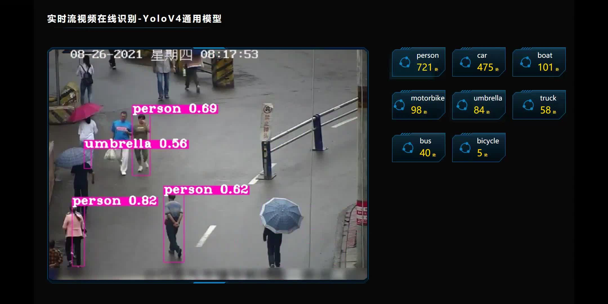
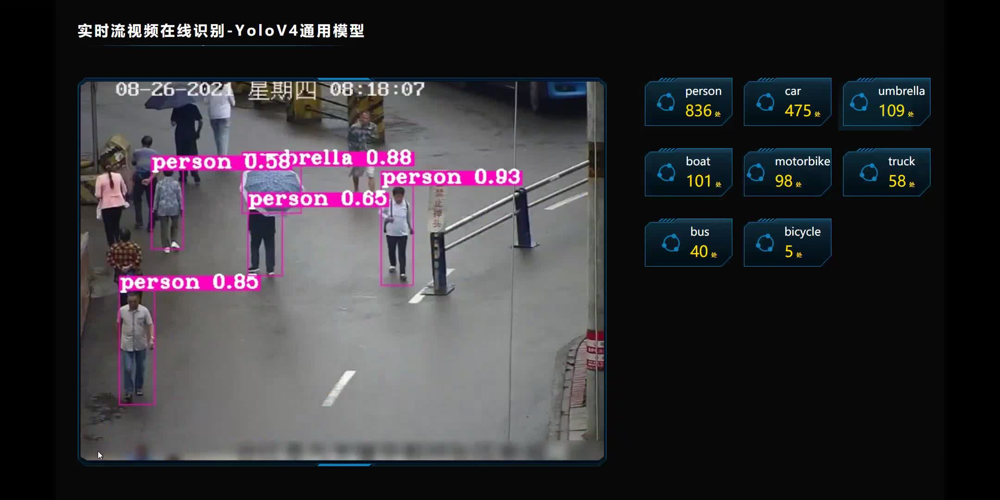
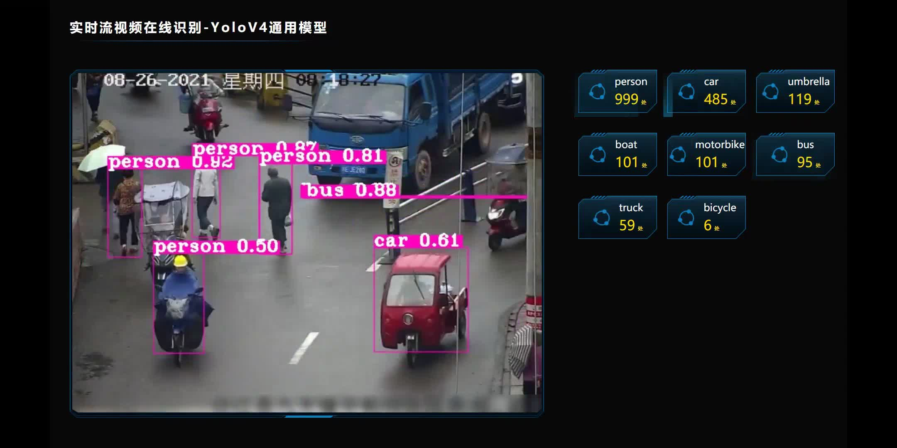

# 基于 GoLand + Gin + Logrus+ OpenCv 4 + WebSocket + YoloV4 + Vue 3

目前市面上AI在Go中的应用和相关使用较少，Go这门语言是我比较喜欢的；另外就是自己在AI部门从事多年该项工作，
但是没有接触这块比较具体的工作，还有比较重要的一点就是为了简化AI识别这块的使用，所以就想自己动手尝试一下这块。
本系统支持直播流（RTSP、RTMP、FLV、HLS） 在线场景智能识别，通过WebSocket的交互方式，跟Web端进行实时关键帧和
识别结果的传输。目前AI识别这块使用的是YoloV4开源模型，在很多特定场景下会出现误识别的情况，如何提高识别率
这是后续的问题了，本系统仅供参考学习使用。

## 识别效果

## OpenCv在Go中如何使用

1. 在windows或者linux下需要自行编译，需要下载CMake和mingw64对源码编译
2. 我是使用gocv下的win_build_opencv.cmd进行编译的，该文件需要根据不同系统的要求进行相应修改，我电脑使用的是win10，
   所以我编译的是基于windows的cpu版本，本来想使用CUDA版本，折腾了好几天最后没弄成功。最好使用CUDA版本进行AI处理，
   否则处理速度和性能会差很多。
3. opencv-4.5.x和opencv-contrib-4.5.x我是手动下载并且解压的，然后放到C盘的opencv目录下进行编译，编译时间大概需要20分钟。
4. 如果使用opencv打开网络视频流，需要下载opencv_videoio_ffmpeg_64.dll，记得名称需要改成编译版本一样的，否则会出错。

## YoloV4在Go中遇到的问题总结

1. yolov4官方提供的模型可以识别80种物体，可以通过提高置信度和非极大抑制值的数值过滤掉一些误识别的结果
2. 如果使用cpu版本来识别，处理单张图片的时间要好几秒，如果想要提高识别时间，可以修改gocv.BlobFormImage的
   image.Pt(416, 416)，改成image.Pt(128, 128)，最低可以改成64，但是会降低识别精度，改成128处理单张图片时间
   大概在200到300毫秒，如果是用CUDA，416处理单张图片时间可以在200到300毫秒。
3. yolov4的模型有250MB,需要到官网去下载。

## WebSocket与Web端的传输性能问题

## 基于Vue 3版本的Web端

## 目前存在问题